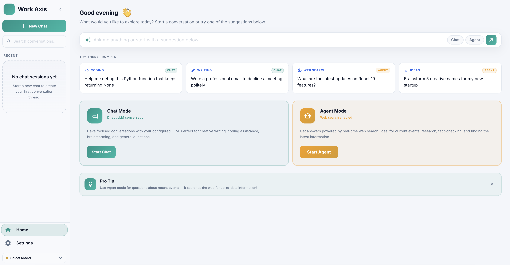
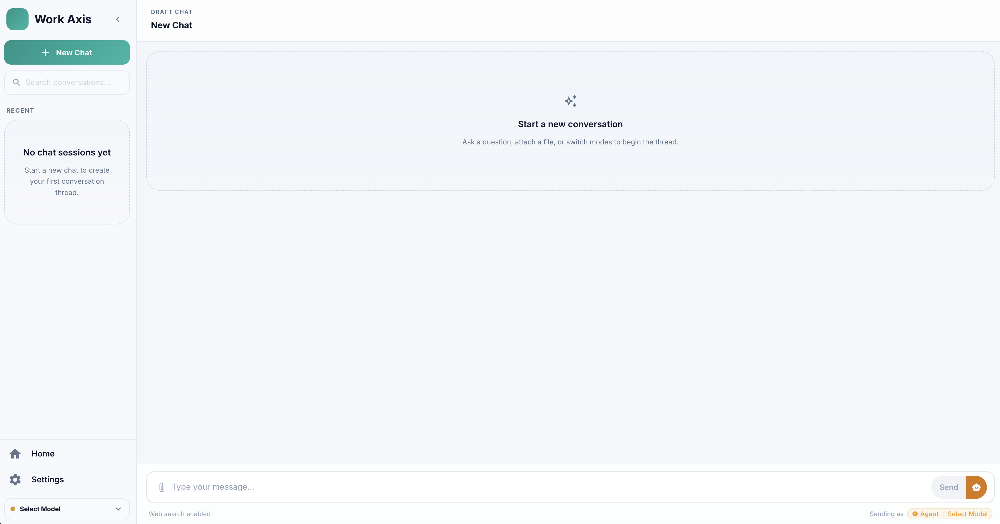
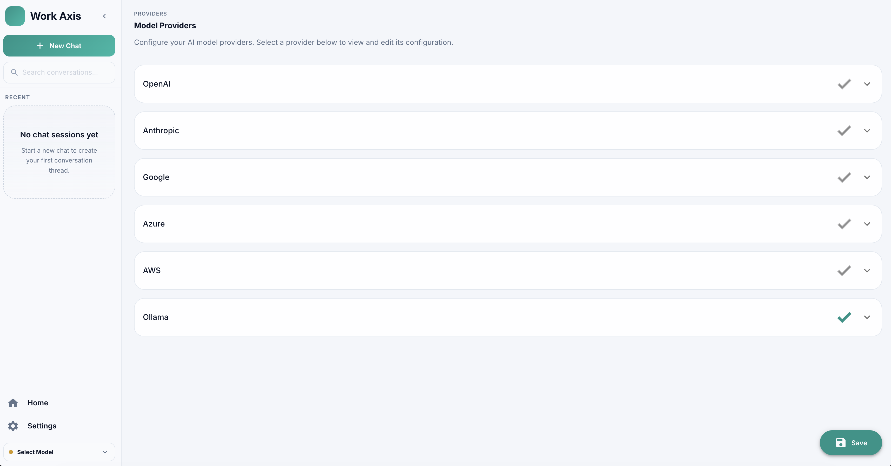

# Work Axis

Work Axis is a desktop chat application that lets you converse with LLMs in two modes: **Chat Mode** for direct, focused conversations, and **Agent Mode** for task-oriented sessions with **web search** and **file upload** support.



## What is this application?

- **Chat Mode** — Direct LLM conversation. Ideal for coding help, writing, brainstorming, and general Q&A.
- **Agent Mode** — Adds real-time **web search** for up-to-date answers and research, plus **file upload** so the agent can reason over your documents.
- Multiple LLM providers are supported and configurable from Settings, including OpenAI, Anthropic, Google, Azure, AWS, and Ollama.
- Conversation history is organized per session, with recent chats listed in the sidebar.





## Tech Stack

### Frontend
- React 18 + TypeScript, built with Vite
- Electron (desktop app shell, packaged with electron-builder)
- MUI (Material UI) + Emotion for UI components/styling
- Redux Toolkit + React Redux for state management
- RxDB / Dexie for local client-side data storage
- React Router for navigation
- Axios for HTTP requests
- Sentry for error monitoring
- ESLint for linting

### Backend
- Python (FastAPI + Uvicorn) serving the API
- LangChain / LangGraph for LLM orchestration, agents, and tool use
- LangChain provider integrations: OpenAI, Anthropic, AWS (Bedrock), Google Generative AI, Ollama
- LangGraph checkpoint (SQLite) for agent state persistence
- ChromaDB + sentence-transformers/fastembed for vector search (RAG)
- Docling for document parsing/ingestion
- SQLAlchemy + DuckDB for data storage
- MCP (Model Context Protocol) adapters for tool integration
- Modular workspace (uv workspaces): `core`, `agents`, `llm_module`, `rag`, `vector_db`, `web_search`
- PyInstaller for building a native executable

### Infrastructure
- Docker / docker-compose for containerized deployment

## How To Run

### Backend
```bash
cd backend

# Install uv (one time)
curl -LsSf https://astral.sh/uv/install.sh | sh

# Install dependencies
uv sync

# run with Docker

cd backend/docker
docker-compose up --build
# Server available at http://127.0.0.1:8001
```

### Frontend
```bash
cd frontend

# Install dependencies
npm install

# Run in browser (Vite dev server)
npm run dev

# Run as Electron desktop app (dev mode)
npm run electron:dev
```
